hostname:
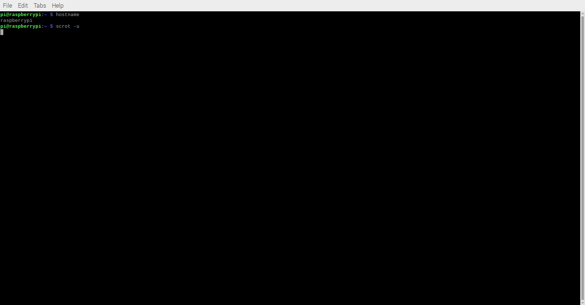
env:
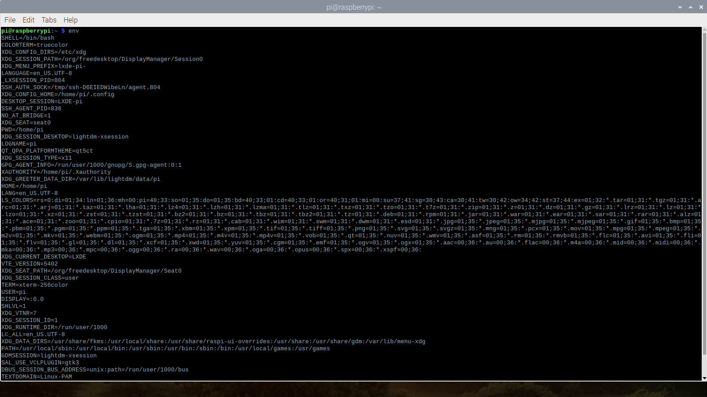
ps, pwd, git clone, cd, ls, df:
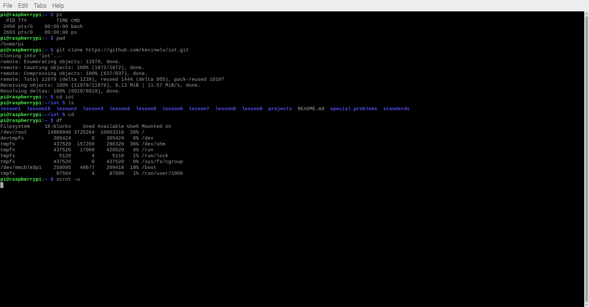
mkdir demo, cd demo:
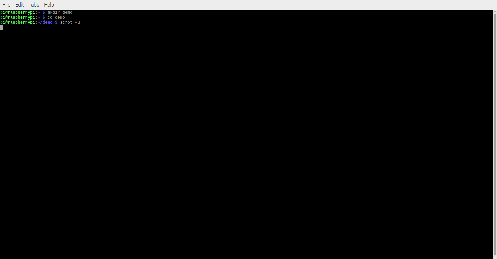
nano file:
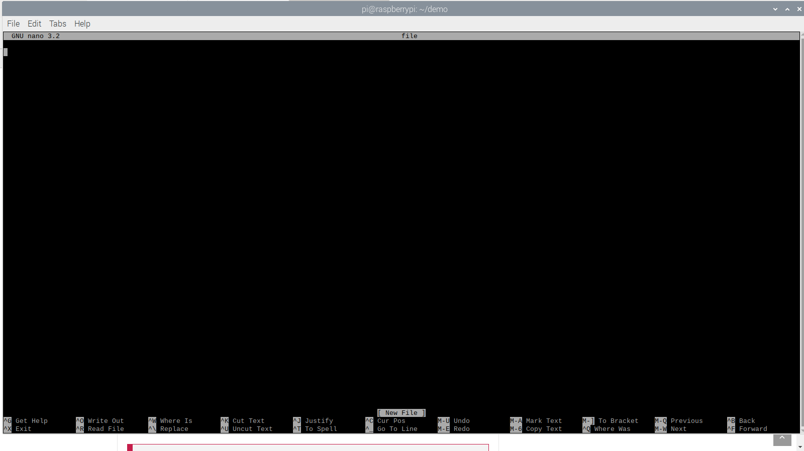
cat file, cp file file1, mv file file2, rm file2, ls:
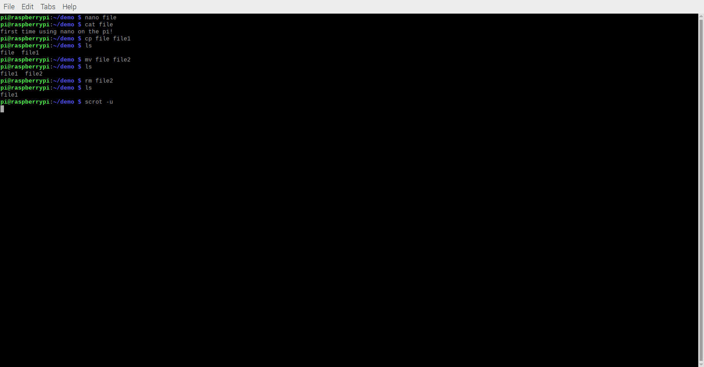
clear:
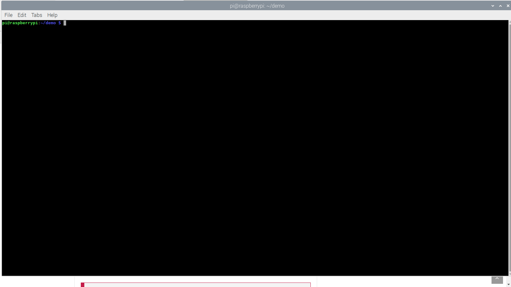
man uname:
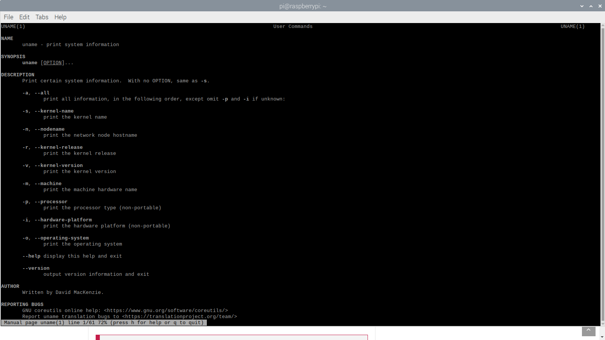
uname -a, ifconfig:
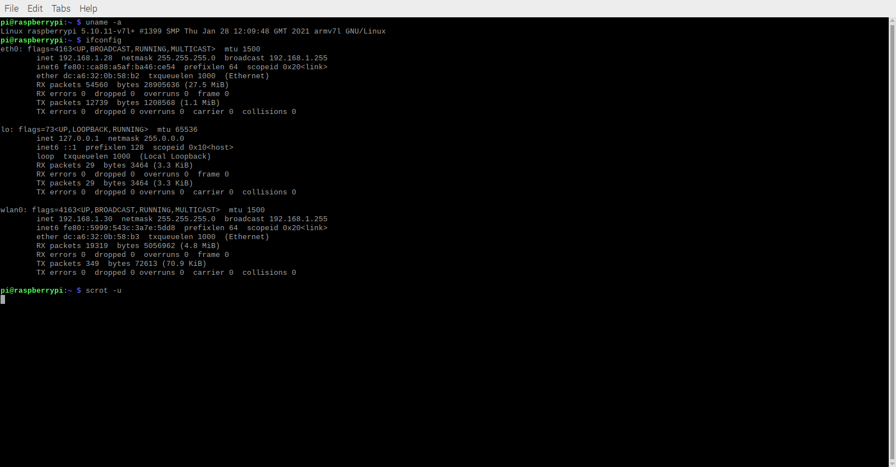
ping localhost:
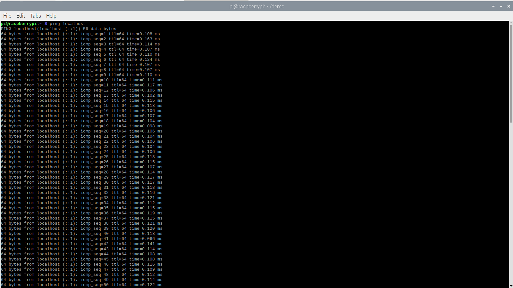
netstat:
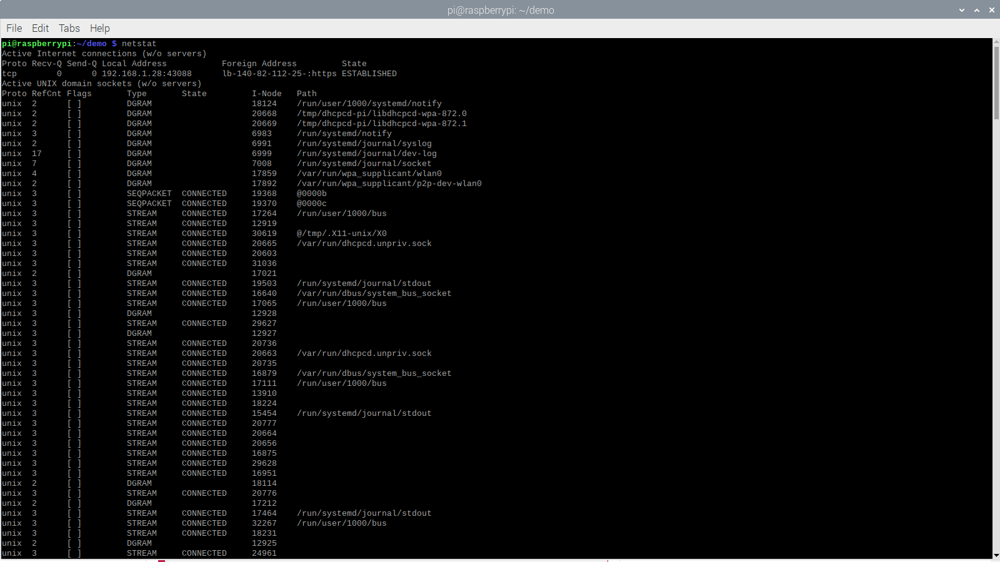
