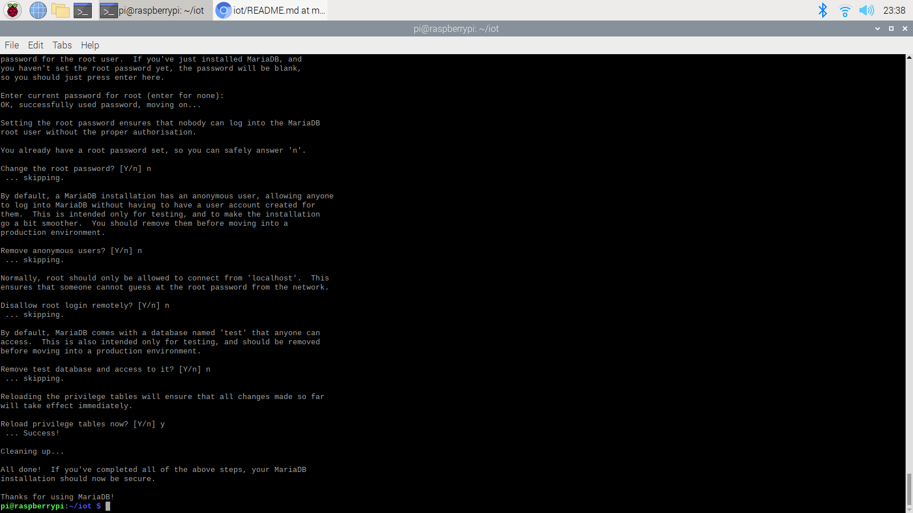

# LAB 4
# Django and Flask
**Django Install:

MariaDB Install:

MariaDB & mySQL:

mySQL:

Edit settings:

Migrations:

Create Superuser:

Start project

Run server:

Server:

Weather station:

My CPU:

Hello World:**

