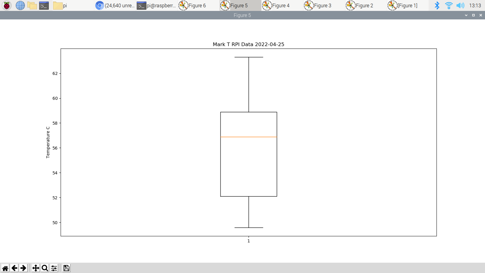

# LAB 8
# Data Analysis
**Installation:**
.png)
.png)
.png)
.png)
### Numpy array
```sh
$ python3
>>> import numpy as np
>>> a = np.arange(6)
>>> a
>>> b = np.arange(12).reshape(4, 3)
>>> b
>>> c = np.arange(24).reshape(2, 3, 4)
>>> c
>>> b.shape
>>> b.reshape(-1)
>>> b.reshape(-1, 1)
>>> b.reshape(2, -1)
>>> d = np.array([20, 30, 40, 50])
>>> e = np.arange(4)
>>> f = d-e
>>> f
>>> e**2
>>> A = np.array([[1, 1], [0, 1]])
>>> B = np.array([[2, 0], [3, 4]])
>>> A*B
>>> A.dot(B)
>>> np.dot(A, B)
>>> g = np.ones((2, 3), dtype=int)
>>> g
>>> h = np.random.random((2, 3))
>>> h
>>> g *= 3
>>> g
>>> h += g
>>> h
>>> k = np.random.random((2, 3))
>>> k
>>> k.sum()
>>> k.min()
>>> k.max()
>>> m = np.arange(12).reshape(3, 4)
>>> m
>>> m.sum(axis = 0)
>>> m.min(axis = 1)
>>> m.cumsum(axis = 1)
>>> n = np.arange(5)
>>> n
>>> n[[1, 3, 4]] = 0
>>> n
>>> exit()
```
.png)
.png)
.png)
### Review and Run Python code
```sh
$ cd ~/iot/lesson8
$ python3 pyplot_simple.py
$ python3 simple_plot.py
$ python3 pyplot_formatstr.py
$ python3 ticklabels_demo_rotation.py
$ python3 pyplot_three.py
$ python3 pyplot_two_subplots.py
$ python3 pyplot_scales.py
$ python3 pyplot_annotate.py
$ python3 major_minor_demo1.py
$ python3 legend_demo.py
```
.png)
.png)
.png)
.png)
.png)
.png)
.png)
.png)
.png)
.png)
### Histograms, box plots, regression, and interpolation
```sh
$ python3 scatter_demo.py
$ python3 histogram_demo_features.py
$ python3 pyplot_text.py
$ python3 histogram_demo_extended.py
$ python3 boxplot_demo.py
$ python3 linreg.py
$ python3 interpolation.py
```
.png)
.png)
.png)
.png)
.png)
.png)
.png)
### Classification, cross-validation (CV), and support-vector machine (SVM)
```sh
$ python3 plot_lda.py
$ python3 plot_lda_qda.py
$ python3 plot_cv_predict.py
$ python3 plot_cv_diabetes.py
$ python3 traffic.py
```
.png)
.png)
.png)
.png)
.png)
### Keras and TensorFlow
```sh
$ python3 keras_diabetes.py
$ python3 keras_first_network.py
```
.png)
.png)
### Titanic example
```sh
$ cp train.csv ~/demo
$ cp test.csv ~/demo
$ cp titanic_1.py ~/demo
$ cp titanic_2.py ~/demo
$ cd ~/demo
$ python3 titanic_1.py
$ python3 titanic_2.py
```
.png)
.png)
## Lab 8B: Data Analysis





